# The Hey! Look! Listen! Website - Frontend Readme

Welcome to the React Frontend for Hey! Look! Listen!

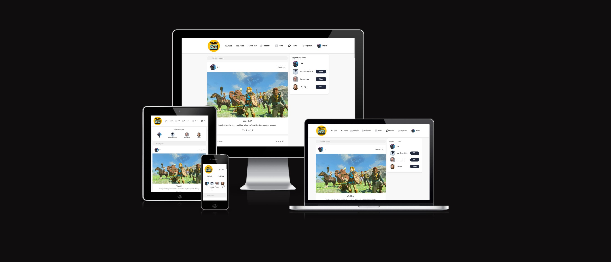

Hey! Look! Listen! is a website where you can check out the latest podcasts and gaming content from HLL. Users are able to create a profile and post photos on the Forum page. They can also like and comment on other users posts. 

This is the frontend of the appliation, built with React.

- The deployed version of the full site built is [HERE](https://hey-look-listen-8c4ae7f879be.herokuapp.com/).

## Project Goal

My goal with this project was to build a fully functioning website for the podcast that I co-host with a few friends. I wanted to build something where listeners to find episodes of the podcasts, Gaming Yarns and also interact with other listeners. My hope was to build something that would help the hosts interact with the community. 

## Wireframes

In the planning stage of this project, I created basic wireframes for desktop and mobile versions of the main pages of the site:

[Desktop and mobile wireframes](frontend/src/assets/wireframes.png)

## User Stories

I have divided the functionality of the site and database into epics and user stories below. These are also documented on my GitHub Project board found [here](https://github.com/users/Supersheep50/projects/5).

This is the view at the end of my project:


### **Epic:** Account Management

**User Stories:**

- As a **user** I can **sign up for an account** so that I can **make and like forum posts**
- As a **user** I can **log in and out of my account** so that I can **access the site from different devices and keep my account secure**
- As a **user** I can **add a profile photo and description** so that **I can personalise my profile**
- As a **user** I can **edit my username, change my password and username** to keep **my personal details safe and secure**

### **Epic:** Managing Posts

**User Stories:**

- As a **user** I can **add a new post** so that **I can talk about my favorite podcast epsidoes**
- As a **user** I can **edit my posts** so that **I can make changes after listening to episodes or rading comments**
- As a **user** I can **delete my posts** so that **I can remove posts made in error, or that I don't want displayed on my profile anymore**
- As a **user** I can **like and unlike other users' posts** so that **I can engage with content that I enjoy**

### **Epic:** Managing Comments

**User Stories:**

- As a **user** I can **comment on other users' posts** so that **I can engage in conversations with other users**
- As a **user** I can **edit comments I have made** so that **I can correct mistakes in my comments**
- As a **user** I can **delete comments I have made** so that **I can remove comments posted by mistake**


### **Epic:** Admin Capabilities

**User Stories:**

- As a **site admin** I can **add, edit, and delete profiles from the database** so that **users have the most up-to-date list of games to choose from**
- As a **site admin** I can **remove posts or comments if they are not appropriate or relevant** so that **the site is enjoyable and accessible to all users**
- As a **site admin** I can **see lists of all user profiles, posts, games, reviews, likes, and comments** so that **I have an overview of all activity on the site**

## Features

### Existing Features

- **Podcast Page**

  - The Podcast Page showcases all the episodes of the HLL podcast with updates every 2 weeks. Users can listen to epiosdes here if they like or click the player and be brought to the HLL Spotify page.
    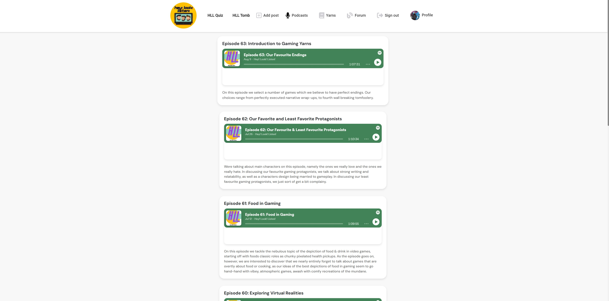
    
- **Add a post**

  - A user can add a post to the HLL forum here. Clicking the button gives users the ability to add an episode title, a photo and some text. A similiar approach to Reddits forum pages.
    
    

- **Delete a post**

  - A user can also edit or delete a Post. 
    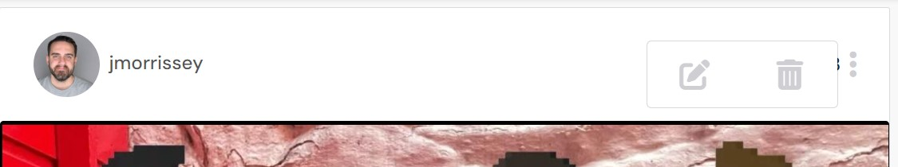
    
- **Gaming Yarns**

  - Users can check out HLL's collection of Gaming Yarns. Short stories about relatively unknown games. 
    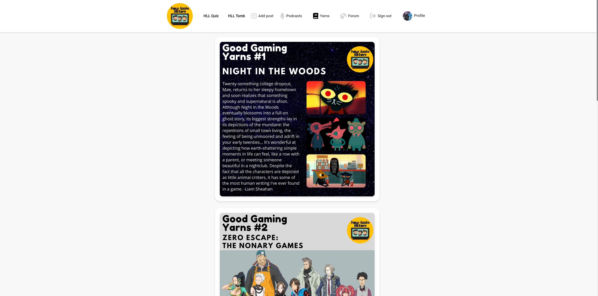

- **Forum**

  - The forum is where Users posts about the Podcast get posted. Here they can view other Users posts and comment and like.
    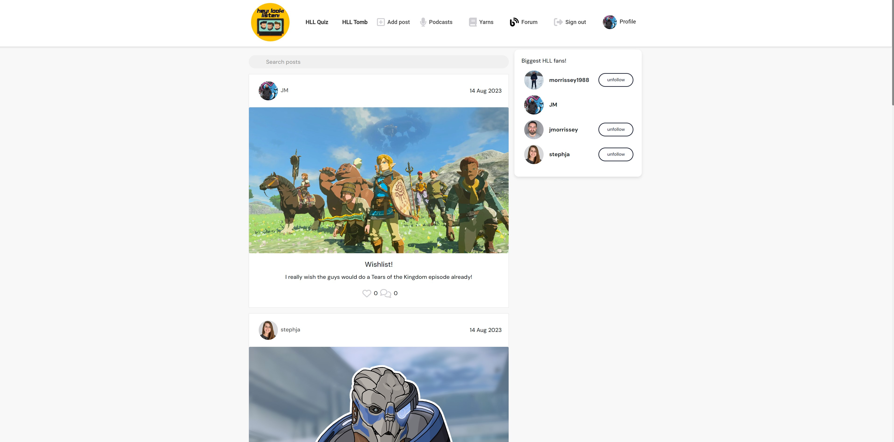

- **Comment**

  - A user can leave a comment on a post. There is a form beneath each post with a free text box. Comments are displayed with the user's profile photo, a link to their profile, and a time stamp showing the date & time the comment was left.
    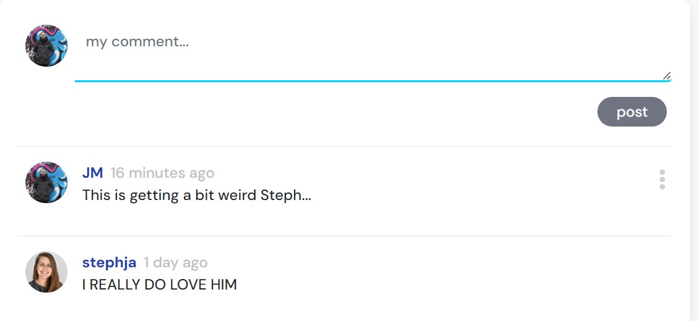

- **Delete a comment**

  - A user can also edit or delete a Comment. 
    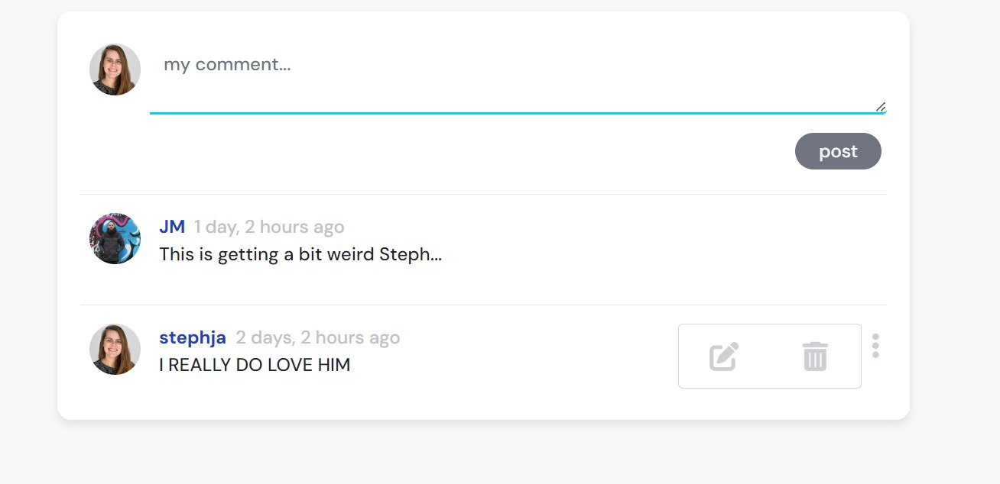
      
- **Sign In Page**

  - The sign in page allows an existing user to sign in to the site. There is a prompt redirecting the user to the sign up page if they don't already have an account. The layout for the sign in and sign up pages are both the same for visual / stylistic consistency.
    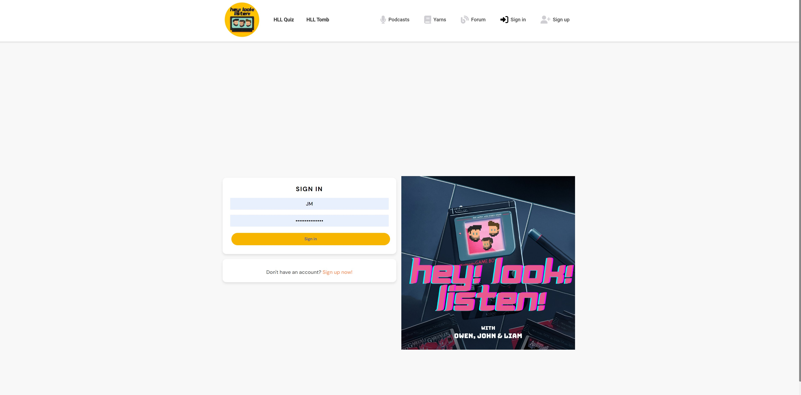

- **Sign Up Page**

  - As above, the sign up page allows a user to create a new account. There is a prompt redirecting the user to the sign in page if they already have an account.
    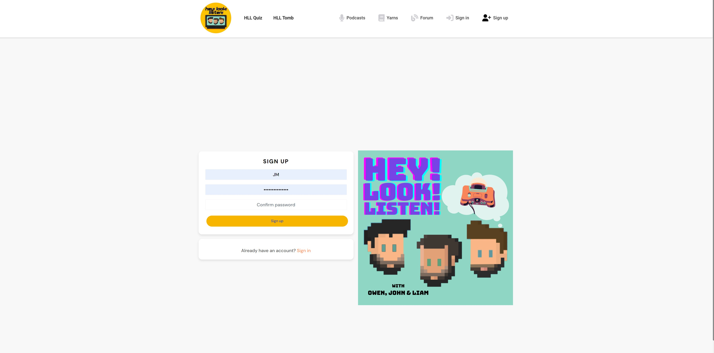

- **Profile Page**
  - The profile page allows a user to view their own or another user's profile. Users can edit their own profile by adding an image and/or a bio. The page also displays the number of posts, followers and how many users they are following. It also shows a feed for their posts.
    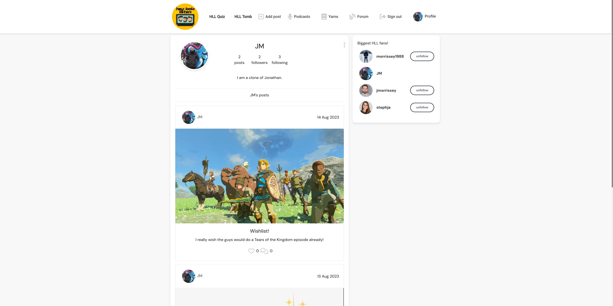

- **Followers**

  - Users can follow and unfollow each other. The top fans of the podcast are displayed on the Forum page. 
    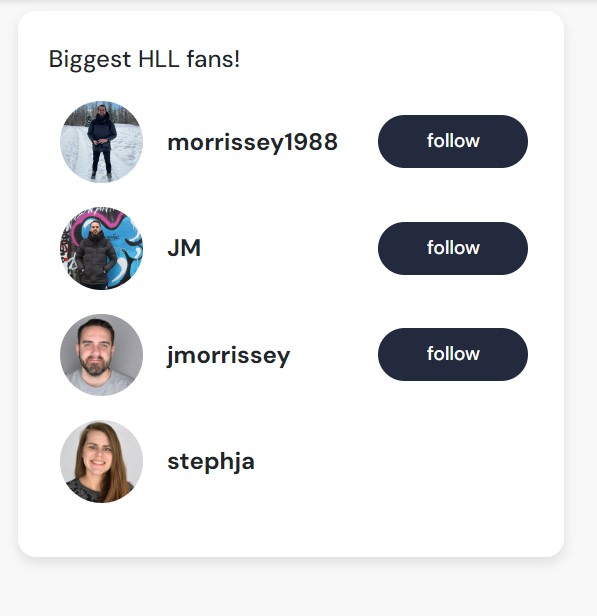
      
- **Exisiting HLL Projects**
  - The Navbar showcases two links to exisiting HLL projects, The HLL Quiz and The Secret of the HLL Tomb.
    

- **Drop down menu**
  - The website is fully responsive. A drop down menu is used for when the website is used on a tablet oh phone.
    

### Reusable Components 

- **Navigation Bar**

  - The navigation bar appears across all pages of the application, and the icons that appear depend on whether the user is logged in or out. Below is the view for a logged in user. 
    
    

- **Spinner** 

- The forum page showcases a spinner while the page is loading. I was unable to take a screenshot as the page was reloading so quickly.

- **Avatar** 

- Users create a profile and add a photo. This shows up on the profile page, Biggest Fans and for each post they make. 
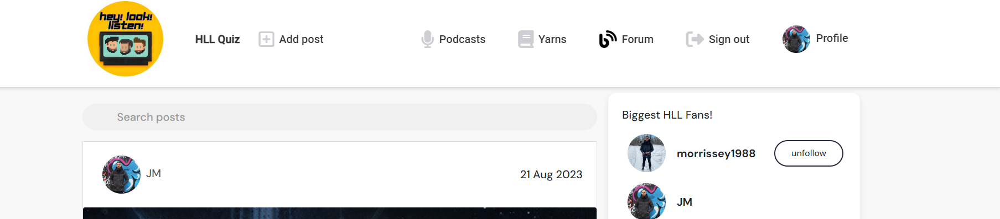

- **Dropdown Menu**

- On mobile and tablet users see the menu in a dropdown menu. This displays across all pages they will click into and use.


- **Not Found**

- If the user lands on a page that is not a part of the website they will be greeted with a Not Found page. 


### Features To Be Implemented

Features that were outside the scope of this project, but that will be added in future sprints:

- I had hoped to include videoplay for our Youtube channel but sadly ran out of time.
- The ability to also up vote or down vote podcast episodes would be a cool feature.
- I would love to incorporate one of my exisiting projects which was a text based game into the website.

## Testing

Please see my [testing file](testing.md) for all manual and validator testing.

## Deployment

### Local Deployment

_Gitpod_ IDE was used to write the code for this project.

To preview the project in the development environment, run the following command in the terminal:
`npm start`. This will open port 3000. Click _Open Browser_ when the popup window appears to open the preview in a new window, or _Open Preview_ to open it within the IDE.

To make a local copy of this repository, you can clone the project by typing the follow into your IDE terminal:

- `git clone https://github.com/Supersheep50/The-Hey-Look-Listen-Website`

Alternatively, if using Gitpod, you can click below to create your own workspace using this repository.

[](https://gitpod.io/#https://github.com/Supersheep50/The-Hey-Look-Listen-Website)

### Heroku Deployment

This project uses [Heroku](https://www.heroku.com), a platform as a service (PaaS) that enables developers to build, run, and operate applications entirely in the cloud.

- Select _New_ in the top-right corner of your Heroku Dashboard, and select _Create new app_ from the dropdown menu.
- Enter a name for your app. The app name must be unique, so you need to adjust the name until you find a name that hasn't been used.
- From the dropdown, choose the region closest to you (EU or USA), and finally, select _Create App_.
- When the app is created, from the _Deploy_ tab, click on _Github_, enter the name of your GitHub repository, and click _Connect_.
- Optionally, turn on automatic deployments, which will deploy to Heroku every time an update has been pushed to GitHub.
- To deploy to Heroku the first time, click _Deploy_ near the bottom of the page.
- _Note:_ unlike the backend application, there is no need to set any Config Vars for the frontend.

### Preparing the File for Deployment

Before your final deployment, complete the following steps:

- In your `index.js` file, remove the `React.StrictMode` component (be sure to delete both opening and closing tags). This is not necessary outside of production.
- In the `package.json file`, in the “scripts” section, add the following prebuild command:
  `"heroku-prebuild": "npm install -g serve",`. This will install a package needed to serve our single page application on heroku
- Create a file called `Procfile` at the root of the project, and in the file, paste in the following web command:
  `web: serve -s build`.

### Final Deployment

- From Gitpod, run a final `git add .`, `git commit -m` with commit message, and `git push`.
- If automatic deploys are enabled in Heroku, the app is now deployed!
- If not, navigate to the _Deploy_ tab on Heroku. Scroll to the bottom of the page, and click _Deploy Branch_.
- Your app is now deployed! 🥳

## Credits

### Content & Code

- Some Frontend code in this project was adapted from Code Institute's Moments walkthrough.
- Some Backend code in this project was adapted from Code Institute's Django walkthrough.
- I used [Spotify Dev Documents](https://developer.spotify.com/documentation/embeds) to help with embedding Spotify podcasts on the podcasts page.
- I used [Stackoverflow](https://stackoverflow.com/questions/60802487/react-images-gallery) some small bits of code and theory adapted here for the Yarns page. 
- Deployment steps are adapted from Code Institute's Momments walkthrough.
- I used [Stackoverflow](https://stackoverflow.com/questions/64927692/implement-follow-and-unfollow-button-in-react-js) when having issues implementing the follow/unfollow functionality. Ended up reverting to the walkthrough code as I hit some big snags that Tutor Support had to help with. 

### Media

- All HLL logos and favicons were created by myself and podcasts co-hosts.
- I used [CloudConvert] to convert images to WEBP format.
- I used [Favicon Generator](https://favicon.io/) to create my favicon.
- The 'no results' icon and 'search icon' are from [Flaticon](https://www.flaticon.com/).


# The Hey! Look! Listen! Website - Backend Readme
Welcome to the DRF API for The Hey! Look! Listen! Website.

Hey! Look! Listen! is a website where you can check out the latest podcasts and gaming content from HLL. Users are able to create a profile and post photos on the Forum page. They can also like and comment on other users posts.

- The deployed version of the full site built in React is [HERE](https://hey-look-listen-8c4ae7f879be.herokuapp.com/).


### Entity Relationship Diagram

- In the planning stage of this project I created an Entity Relationship Diagram to plan out how different componenets of the website would work together. This did change and alter over the course of the project as the plan for the website got bigger.
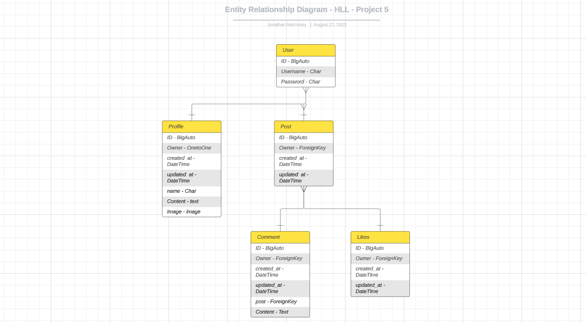

## Features

### Existing Features

- **Navigation Bar**

  - The backend of the project can be accessed via the Django admin panel. Here the only admin superuser (JM) can make changes to comments, likes, posts, profiles and followers. This is an element of defensive design so other users cant access it.
    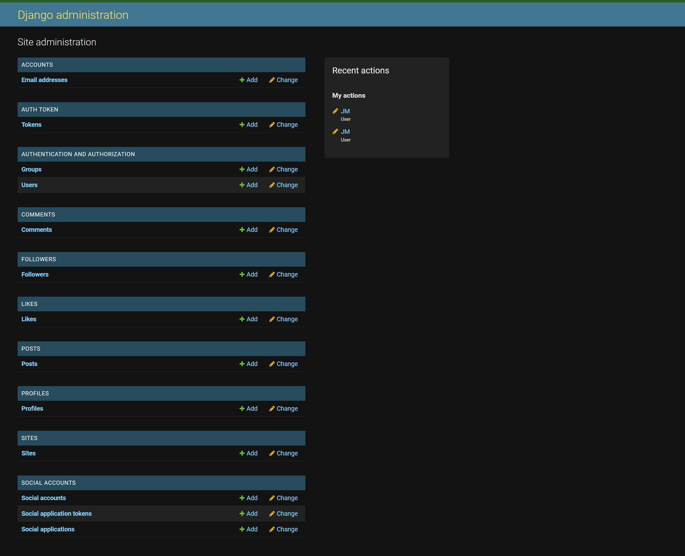
   

## User Stories

I have divided the functionality of the site and database into epics and user stories below. These are also documented on my GitHub Project board found [here](https://github.com/users/Supersheep50/projects/5).

This is the view at the end of my project:


All user stories marked 'Must Have' have been completed, and some 'Should Have' user stories are still to be completed. The site functions without these, but they should be implemented in future sprints to create a better user experience.

### **Epic:** Account Management

**User Stories:**

- As a **user** I can **sign up for an account** so that I can **make and like forum posts**
- As a **user** I can **log in and out of my account** so that I can **access the site from different devices and keep my account secure**
- As a **user** I can **add a profile photo and description** so that **I can personalise my profile**
- As a **user** I can **edit my username, change my password and username** to keep **my personal details safe and secure**

### **Epic:** Managing Posts

**User Stories:**

- As a **user** I can **add a new post** so that **I can talk about my favorite podcast epsidoes**
- As a **user** I can **edit my posts** so that **I can make changes after listening to episodes or rading comments**
- As a **user** I can **delete my posts** so that **I can remove posts made in error, or that I don't want displayed on my profile anymore**
- As a **user** I can **like and unlike other users' posts** so that **I can engage with content that I enjoy**

### **Epic:** Managing Comments

**User Stories:**

- As a **user** I can **comment on other users' posts** so that **I can engage in conversations with other users**
- As a **user** I can **edit comments I have made** so that **I can correct mistakes in my comments**
- As a **user** I can **delete comments I have made** so that **I can remove comments posted by mistake**


### **Epic:** Admin Capabilities

**User Stories:**

- As a **site admin** I can **add, edit, and delete profiles from the database** so that **users have the most up-to-date list of games to choose from**
- As a **site admin** I can **remove posts or comments if they are not appropriate or relevant** so that **the site is enjoyable and accessible to all users**
- As a **site admin** I can **see lists of all user profiles, posts, games, reviews, likes, and comments** so that **I have an overview of all activity on the site**

## Testing 
Manual and validator testing is documented in my [Testing file](testing.md).

## Deployment

### Local Deployment
​
*Gitpod* IDE was used to write the code for this project.

To preview the project in the development environment, run the following command in the terminal:
```python3 manage.py runterminal```. This will open port 8000. Click *Open Browser* when the popup window appears.

To make a local copy of this repository, you can clone the project by typing the follow into your IDE terminal:
- `git clone https://github.com/Supersheep50/The-Hey-Look-Listen-Website` 

Alternatively, if using Gitpod, you can click below to create your own workspace using this repository.

[](https://supersheep50-hllbackend-vfio4emeyia.ws-eu104.gitpod.io)

### Preparing File for Deployment
If you have not already set up Postgres for use in the deployed application, complete the following steps:

- In the terminal, type `pip3 install psycopg2-binary` and press enter.
- Install gunicorn, which will act as the web server. Type `pip3 install gunicorn` in the terminal and press enter.
- You can install this project's requirements (where applicable) using: `pip3 install -r requirements.txt`. If you have your own packages that have been installed, which I did, then the requirements file needs to be updated using: `pip3 freeze --local > requirements.txt`:
  - In the terminal, type `pip3 freeze --local > requirements.txt`. This will create or update a file called `requirements.txt`, with a list of all the packages that Heroku will need to install to run our app.
- Create a Procfile in the root folder of your project, and add the following to the Procfile: `web: gunicorn <app_name>.wsgi:application`.

### ElephantSQL Deployment

To host my database, I used ElephantSQL. 

The instructions to create a new account can be[found here](https://code-institute-students.github.io/deployment-docs/02-elephantsql/elephantsql-01-sign-up), provided by Code Institute. 

Once you have created an account:
- Log in to ElephantSQL to access your dashboard.
- Click *Create New Instance*.
- Give your plan a name (usually the name of the project, in this case *Hey-Look-Listen*).
- Select the Tiny Turtle (Free) plan.
- Leave the Tags field blank.
- Click *Select Region* and choose a data center near you.
- Click *Review*, then, if everything looks correct, *Create Instance*.
- Go back to your dashboard and click on the name of the project. 
- Copy the database URL for your project, and use it in two places:
  - In your `env.py` file, create a new key called `DATABASE_URL` and give it the value of the ElephantSQL database URL, as follows: ` os.environ.setdefault("DATABASE_URL", "my_copied_database_url")`.
    - Before deploying the project, create a file called `env.py` (if it hasn't been created already), and complete the following steps:
      - In `settings.py`: At the top of the file, add the following import:
      ```python
      import os

      if os.path.isfile("env.py"):
          import env
      ```
      - Replace the pasted-in database url with the following code:
      ```python
      os.environ.get("DATABASE_URL")
      ```
  - Paste the database URL into the config vars section of your project on Heroku - instructions are in the *Heroku Deployment* section below. 

After the above steps are completed, install dj-database-url to your project, by typing the following command in the terminal and pressing enter:
- `os.environ.setdefault("DATABASE_URL", "my_copied_database_url")`
- Then update `requirements.txt` by typing `pip3 freeze --local > requirements.txt`.

### Heroku Deployment
​
This project uses [Heroku](https://www.heroku.com), a platform as a service (PaaS) that enables developers to build, run, and operate applications entirely in the cloud.

To set up an account:

- Go to [heroku.com](https://www.heroku.com) to register for a free account.
- For my account, I set my *Role* as *Hobbyist* and *Primary development language* as Python.
- Click *Create free account*.

I used the [Code Institute Gitpod Full Template](https://github.com/Code-Institute-Org/gitpod-full-template) for this project, which means the Heroku command line interface (CLI) came pre-installed. Please check the [Heroku documentation](https://devcenter.heroku.com/articles/heroku-cli) for the most up-to-date installation instructions. 

To log in to the Heroku CLI:

- In the terminal, type ```heroku login -i``` and press enter.. 
- Enter your username and password in the terminal.
- If you have Multi-Factor Authentication turned on:
  - Click on Account Settings (via the avatar menu) on the Heroku Dashboard.
  - Scroll down to the API Key section and click Reveal. Copy the key.
  - Use the login command: heroku login -i
  - Enter your Heroku username.
  - Enter the API key you just copied when prompted for your password.

Deployment steps are as follows, from the Heroku dashboard:
​
- Select *New* in the top-right corner of your Heroku Dashboard, and select *Create new app* from the dropdown menu.
- Enter a name for your app. The app name must be unique, so you need to adjust the name until you find a name that hasn't been used.
- From the dropdown, choose the region closest to you (EU or USA), and finally, select *Create App*.
- From the new app *Settings*, click *Reveal Config Vars*, and add a new Config Var with the KEY set to `DATABASE_URL` and the value to the ElephantSQL database URL you copied above.
- I added additional Config Vars for the folLowing:
  - `ALLOWED_HOST` with the url for my deployed API (* hey-look-listen-8c4ae7f879be.herokuapp.com*).
  - `CLIENT_ORIGIN` with the url for my deployed frontend application (*https://supersheep50-hey-look-listen-vfio4emeyia.ws-eu102.gitpod.io*).
  - `CLIENT_ORIGIN_DEV` with the url for the development version of my frontend application ()
  - `CLOUDINARY_URL` copied from my [Cloudinary](https://cloudinary.com/) dashboard, because I used Cloudinary to host my static files.
  - `DISABLE_COLLECTSTATIC` to *1* because I do not need to load new static files on deployment.
  - `SECRET_KEY` which contains my secret key (also included in `env.py`).

For Heroku deployment, follow these steps to connect your GitHub repository to the newly created app:
​
- At the top of the screen on Heroku, select *Deploy*.
- Next to *Deployment method* select *GitHub*, then scroll down and click *Connect to GitHub* to confirm you want to connect.
- In the *repo-name* field, search for the name of the GitHub repository to deploy, and click *Search*.
- Click *Connect* to link the GitHub repository with Heroku. 
- Scroll down to the *Manual deploy* section, and click *Deploy Branch*.
- If you like, click *Enable Automatic Deploys* in the *Automatic deploys* section to have Heroku rebuild your app every time you push a new change to GitHub.

Push this update to GitHub, and the project should now be deployed and live on Heroku. 


### Thank you 

Huge thank you to my mentor AJ who was super supportive throughout. Big shout out to my partner Steph who helped me since day 1 of the course, couldn't have done it without her.